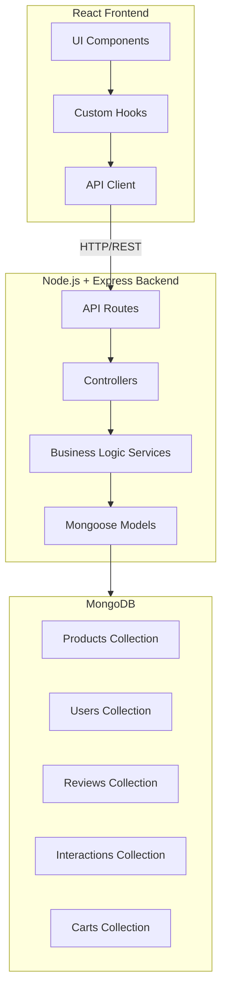

# Design Document: E-Commerce Product Features

## Overview

This design implements a comprehensive suite of product discovery and management features for an e-commerce platform. The system uses a full-stack architecture with:

- **Frontend**: React (existing) for user interface
- **Backend**: Node.js + Express for REST API
- **Database**: MongoDB for persistent data storage

The architecture follows a modular approach with separate services for search, filtering, sorting, recommendations, and pricing. Key design decisions include:

- **MongoDB** for persistent product catalog, user profiles, and interaction tracking
- **MongoDB text indexes** for efficient full-text search
- **Express REST API** with clear endpoint structure
- **Content-based filtering** for recommendations (collaborative filtering deferred to future iterations)
- **Weighted scoring algorithms** for ranking and relevance
- **Time-decay models** for popularity tracking
- **Rule-based dynamic pricing** (ML-based pricing deferred to future iterations)
- **Redis caching** (optional) for frequently accessed data like popular products

## Architecture

### High-Level Architecture



### API Architecture

**Base URL**: `http://localhost:5000/api`

**Endpoints**:
- `GET /products` - Get all products with optional filters, search, sort
- `GET /products/:id` - Get single product details
- `POST /products` - Create new product (admin)
- `PUT /products/:id` - Update product (admin)
- `DELETE /products/:id` - Delete product (admin)
- `GET /products/search` - Search products with query
- `GET /products/recommendations/:id` - Get similar products
- `GET /products/popular` - Get best sellers
- `GET /products/personalized/:userId` - Get personalized recommendations
- `POST /cart` - Create/update cart
- `GET /cart/:userId` - Get user's cart
- `POST /cart/checkout` - Calculate checkout total
- `POST /reviews` - Add product review
- `GET /reviews/:productId` - Get product reviews
- `POST /interactions` - Track user interactions (views, clicks)
- `GET /inventory/alerts` - Get reorder alerts (admin)

### Component Responsibilities

**Frontend (React)**:
1. **UI Components**: Display products, handle user interactions
2. **Custom Hooks**: Manage API calls and state
3. **API Client**: Axios-based HTTP client for backend communication

**Backend (Node.js + Express)**:
1. **Routes**: Define API endpoints and request validation
2. **Controllers**: Handle HTTP requests/responses
3. **Services**: Business logic for search, filtering, recommendations, pricing
4. **Models**: Mongoose schemas for MongoDB collections

**Database (MongoDB)**:
1. **Products Collection**: Store product catalog with text indexes
2. **Users Collection**: Store user profiles and browsing history
3. **Reviews Collection**: Store product reviews and ratings
4. **Interactions Collection**: Track views, cart adds, purchases for popularity
5. **Carts Collection**: Store user shopping carts

## Components and Interfaces

### Backend Components

### 1. MongoDB Schemas (Mongoose Models)

**Product Schema**:
```javascript
const productSchema = new mongoose.Schema({
  id: { type: Number, required: true, unique: true },
  name: { type: String, required: true, text: true },
  description: { type: String, text: true },
  category: { type: String, required: true, index: true },
  image: String,
  new_price: { type: Number, required: true, index: true },
  old_price: { type: Number, required: true },
  rating: { type: Number, default: 0, min: 0, max: 5 },
  reviewCount: { type: Number, default: 0 },
  stock: { type: Number, default: 0 },
  costPrice: Number,
  popularity: { type: Number, default: 1, index: true },
  tags: [String],
  createdAt: { type: Date, default: Date.now },
  updatedAt: { type: Date, default: Date.now }
});

// Text index for search
productSchema.index({ name: 'text', description: 'text' });
```

**User Schema**:
```javascript
const userSchema = new mongoose.Schema({
  userId: { type: String, required: true, unique: true },
  viewedProducts: [{ type: Number, ref: 'Product' }],
  viewedCategories: Map,  // category -> count
  priceRange: {
    min: Number,
    max: Number
  },
  lastActive: { type: Date, default: Date.now }
});
```

**Review Schema**:
```javascript
const reviewSchema = new mongoose.Schema({
  productId: { type: Number, required: true, index: true },
  userId: String,
  rating: { type: Number, required: true, min: 0, max: 5 },
  comment: String,
  upvotes: { type: Number, default: 0 },
  downvotes: { type: Number, default: 0 },
  createdAt: { type: Date, default: Date.now }
});
```

**Interaction Schema**:
```javascript
const interactionSchema = new mongoose.Schema({
  productId: { type: Number, required: true, index: true },
  userId: String,
  type: { type: String, enum: ['view', 'cart_add', 'purchase'] },
  timestamp: { type: Date, default: Date.now, index: true }
});
```

**Cart Schema**:
```javascript
const cartSchema = new mongoose.Schema({
  userId: { type: String, required: true, unique: true },
  items: [{
    productId: Number,
    quantity: Number,
    price: Number
  }],
  coupon: {
    code: String,
    discountPercent: Number
  },
  updatedAt: { type: Date, default: Date.now }
});
```

### 2. Backend Services

**ProductService.js**:
```javascript
class ProductService {
  async getAllProducts(filters = {}) {
    // Apply filters: category, priceRange, inStock
    // Return filtered products
  }
  
  async getProductById(id) {
    // Return single product
  }
  
  async searchProducts(query, options = {}) {
    // Use MongoDB text search
    // Calculate relevance scores
    // Return ranked results
  }
  
  async createProduct(productData) {
    // Create new product
  }
  
  async updateProduct(id, updates) {
    // Update product
  }
  
  async deleteProduct(id) {
    // Delete product
  }
}
```

**SearchService.js**:
```javascript
class SearchService {
  async search(query, filters = {}) {
    // MongoDB text search with $text operator
    // Calculate relevance: textScore * 0.5 + popularity * 0.3 + rating * 0.2
    // Apply filters and sorting
    // Return results
  }
  
  calculateRelevance(product, textScore) {
    // Weighted formula
  }
  
  expandQueryWithSynonyms(query) {
    // Add synonyms to search
  }
  
  suggestCorrections(query) {
    // Spell correction
  }
}
```

**FilterService.js**:
```javascript
class FilterService {
  buildFilterQuery(criteria) {
    // Build MongoDB query from filter criteria
    // category, priceRange, inStock, minRating
  }
  
  async applyFilters(baseQuery, filters) {
    // Combine with existing query
  }
}
```

**SortService.js**:
```javascript
class SortService {
  buildSortQuery(criteria) {
    // Build MongoDB sort object
    // price, discount, popularity, rating
  }
}
```

**RecommendationService.js**:
```javascript
class RecommendationService {
  async getSimilarProducts(productId, limit = 4) {
    // Get product
    // Find products in same category
    // Filter by price range (within 30%)
    // Calculate similarity scores
    // Return top N
  }
  
  async getPersonalizedRecommendations(userId, limit = 10) {
    // Get user profile
    // Find products from most-viewed categories
    // Filter by user's price range
    // Return recommendations
  }
  
  calculateSimilarity(product1, product2) {
    // Category similarity * 0.6 + price similarity * 0.4
  }
}
```

**PricingService.js**:
```javascript
class PricingService {
  calculateDiscount(oldPrice, newPrice) {
    // Return discount percentage
  }
  
  formatDiscount(percentage) {
    // Return "X% OFF"
  }
  
  async calculateCartTotal(userId, taxRate = 0.1) {
    // Get cart
    // Calculate subtotal
    // Apply coupon
    // Calculate tax
    // Return total breakdown
  }
  
  async applyDynamicPricing(productId) {
    // Get product and stock data
    // Apply pricing rules
    // Update product price
  }
}
```

**InventoryService.js**:
```javascript
class InventoryService {
  async updateStock(productId, quantity) {
    // Update stock level
  }
  
  async checkReorderPoint(productId) {
    // Calculate if reorder needed
  }
  
  async calculateReorderPoint(productId) {
    // Formula: (avgDailySales * leadTime) + safetyStock
  }
  
  async updatePopularity(productId) {
    // Get interactions
    // Calculate: views*1 + cartAdds*5 + purchases*10
    // Apply time decay
    // Update product popularity
  }
  
  async getPopularProducts(limit = 10) {
    // Return top products by popularity
  }
  
  async forecastDemand(productId, days = 30) {
    // 30-day moving average
  }
}
```

**InteractionService.js**:
```javascript
class InteractionService {
  async trackInteraction(productId, userId, type) {
    // Save interaction
    // Update popularity asynchronously
  }
  
  async getUserInteractions(userId) {
    // Get user's interaction history
  }
}
```

### 3. API Controllers

**ProductController.js**:
```javascript
class ProductController {
  async getAll(req, res) {
    // Parse query params: category, minPrice, maxPrice, inStock
    // Call ProductService
    // Return JSON
  }
  
  async getById(req, res) {
    // Get product by ID
    // Track view interaction
    // Return JSON
  }
  
  async search(req, res) {
    // Parse search query and filters
    // Call SearchService
    // Return JSON
  }
  
  async getRecommendations(req, res) {
    // Get product ID from params
    // Call RecommendationService
    // Return JSON
  }
  
  async getPopular(req, res) {
    // Call InventoryService.getPopularProducts
    // Return JSON
  }
  
  async getPersonalized(req, res) {
    // Get userId from params
    // Call RecommendationService
    // Return JSON
  }
  
  async create(req, res) {
    // Admin only
    // Validate and create product
  }
  
  async update(req, res) {
    // Admin only
    // Update product
  }
  
  async delete(req, res) {
    // Admin only
    // Delete product
  }
}
```

**CartController.js**:
```javascript
class CartController {
  async getCart(req, res) {
    // Get user's cart
  }
  
  async updateCart(req, res) {
    // Add/update/remove items
  }
  
  async calculateCheckout(req, res) {
    // Calculate total with tax and coupon
    // Return breakdown
  }
}
```

**ReviewController.js**:
```javascript
class ReviewController {
  async getReviews(req, res) {
    // Get product reviews
    // Sort by helpfulness
  }
  
  async addReview(req, res) {
    // Add review
    // Update product rating
  }
  
  async voteReview(req, res) {
    // Upvote/downvote review
  }
}
```

### Frontend Components

**API Client (axios)**:
```javascript
// src/api/client.js
import axios from 'axios';

const API_BASE_URL = 'http://localhost:5000/api';

export const api = axios.create({
  baseURL: API_BASE_URL,
  headers: {
    'Content-Type': 'application/json'
  }
});

// Product API
export const productAPI = {
  getAll: (params) => api.get('/products', { params }),
  getById: (id) => api.get(`/products/${id}`),
  search: (query, filters) => api.get('/products/search', { params: { q: query, ...filters } }),
  getRecommendations: (id) => api.get(`/products/recommendations/${id}`),
  getPopular: () => api.get('/products/popular'),
  getPersonalized: (userId) => api.get(`/products/personalized/${userId}`)
};

// Cart API
export const cartAPI = {
  getCart: (userId) => api.get(`/cart/${userId}`),
  updateCart: (userId, items) => api.post('/cart', { userId, items }),
  checkout: (userId, taxRate) => api.post('/cart/checkout', { userId, taxRate })
};

// Review API
export const reviewAPI = {
  getReviews: (productId) => api.get(`/reviews/${productId}`),
  addReview: (review) => api.post('/reviews', review)
};

// Interaction API
export const interactionAPI = {
  track: (productId, userId, type) => api.post('/interactions', { productId, userId, type })
};
```

**Custom Hooks**:
```javascript
// src/hooks/useProducts.js
export const useProducts = (filters = {}) => {
  const [products, setProducts] = useState([]);
  const [loading, setLoading] = useState(false);
  
  useEffect(() => {
    fetchProducts();
  }, [filters]);
  
  const fetchProducts = async () => {
    setLoading(true);
    const response = await productAPI.getAll(filters);
    setProducts(response.data);
    setLoading(false);
  };
  
  return { products, loading, refetch: fetchProducts };
};

// src/hooks/useSearch.js
export const useSearch = () => {
  const [results, setResults] = useState([]);
  const [loading, setLoading] = useState(false);
  
  const search = async (query, filters = {}) => {
    setLoading(true);
    const response = await productAPI.search(query, filters);
    setResults(response.data);
    setLoading(false);
  };
  
  return { results, loading, search };
};

// src/hooks/useRecommendations.js
export const useRecommendations = (productId) => {
  const [recommendations, setRecommendations] = useState([]);
  
  useEffect(() => {
    if (productId) {
      fetchRecommendations();
    }
  }, [productId]);
  
  const fetchRecommendations = async () => {
    const response = await productAPI.getRecommendations(productId);
    setRecommendations(response.data);
  };
  
  return { recommendations };
};

// src/hooks/useCart.js
export const useCart = (userId) => {
  const [cart, setCart] = useState(null);
  const [total, setTotal] = useState(null);
  
  const fetchCart = async () => {
    const response = await cartAPI.getCart(userId);
    setCart(response.data);
  };
  
  const updateCart = async (items) => {
    const response = await cartAPI.updateCart(userId, items);
    setCart(response.data);
  };
  
  const calculateCheckout = async (taxRate = 0.1) => {
    const response = await cartAPI.checkout(userId, taxRate);
    setTotal(response.data);
  };
  
  return { cart, total, fetchCart, updateCart, calculateCheckout };
};
```

## Data Models

### MongoDB Collections

**Products Collection**:
```javascript
{
  _id: ObjectId,
  id: Number (unique),
  name: String (indexed for text search),
  description: String (indexed for text search),
  category: String (indexed),
  image: String,
  new_price: Number (indexed),
  old_price: Number,
  costPrice: Number,
  rating: Number (0-5),
  reviewCount: Number,
  stock: Number,
  popularity: Number (indexed),
  tags: [String],
  createdAt: Date,
  updatedAt: Date
}
```

**Users Collection**:
```javascript
{
  _id: ObjectId,
  userId: String (unique),
  viewedProducts: [Number],
  viewedCategories: Map<String, Number>,
  priceRange: { min: Number, max: Number },
  lastActive: Date
}
```

**Reviews Collection**:
```javascript
{
  _id: ObjectId,
  productId: Number (indexed),
  userId: String,
  rating: Number (0-5),
  comment: String,
  upvotes: Number,
  downvotes: Number,
  createdAt: Date
}
```

**Interactions Collection**:
```javascript
{
  _id: ObjectId,
  productId: Number (indexed),
  userId: String,
  type: Enum['view', 'cart_add', 'purchase'],
  timestamp: Date (indexed)
}
```

**Carts Collection**:
```javascript
{
  _id: ObjectId,
  userId: String (unique),
  items: [{
    productId: Number,
    quantity: Number,
    price: Number
  }],
  coupon: {
    code: String,
    discountPercent: Number
  },
  updatedAt: Date
}
```

### Data Flow

**Search Flow**:
```
User Query → Frontend → API Request → SearchService → MongoDB Text Search → 
Calculate Relevance → Sort by Score → Return Results → Frontend Display
```

**Filter Flow**:
```
Filter Criteria → Frontend → API Request → FilterService → Build MongoDB Query → 
Execute Query → Return Filtered Products → Frontend Display
```

**Recommendation Flow**:
```
Product ID → Frontend → API Request → RecommendationService → 
Get Product → Query Similar Products → Calculate Similarity → 
Sort by Score → Return Top N → Frontend Display
```

**Cart Checkout Flow**:
```
User ID → Frontend → API Request → CartService → Get Cart → 
PricingService → Calculate Subtotal → Apply Coupon → Calculate Tax → 
Return Total Breakdown → Frontend Display
```

**Popularity Update Flow**:
```
User Interaction → Frontend → API Request → InteractionService → 
Save Interaction → Async Job → InventoryService → 
Calculate Popularity → Update Product → Complete
```


## Correctness Properties

*A property is a characteristic or behavior that should hold true across all valid executions of a system—essentially, a formal statement about what the system should do. Properties serve as the bridge between human-readable specifications and machine-verifiable correctness guarantees.*

### Property 1: Product Catalog Uniqueness

*For any* product catalog and any product being added, the assigned product ID must be unique and not conflict with any existing product ID in the catalog.

**Validates: Requirements 1.1, 1.2**

### Property 2: Category Retrieval Completeness

*For any* product catalog and any category, retrieving products by that category must return all and only products that belong to that category.

**Validates: Requirements 1.5**

### Property 3: Search Result Correctness

*For any* search query and product catalog, all returned products must contain at least one of the search keywords in their name or description (case-insensitive, partial matches allowed).

**Validates: Requirements 2.1, 2.3**

### Property 4: Search Result Ranking

*For any* search query with multiple matching products, the results must be ordered by descending relevance score, where relevance is calculated as: (exactMatchScore * 0.5) + (popularityScore * 0.3) + (ratingScore * 0.2).

**Validates: Requirements 2.2, 7.1, 7.2, 7.4, 7.5**

### Property 5: Category Filter Correctness

*For any* product set and any category filter, the filtered results must contain only products belonging to the specified categories, and applying then removing a filter must restore the original product set.

**Validates: Requirements 3.1, 3.2, 3.4, 3.5**

### Property 6: Sort Correctness and Stability

*For any* product set and any sort criteria (price, discount, popularity, rating), the sorted results must be ordered according to the criteria, and products with identical sort values must maintain stable ordering by product ID.

**Validates: Requirements 4.1, 4.2, 4.3, 4.4, 4.5**

### Property 7: Discount Calculation Accuracy

*For any* product with old_price and new_price, the discount percentage must equal Math.round(((old_price - new_price) / old_price) * 100), with a minimum value of 0, and be formatted as "X% OFF".

**Validates: Requirements 5.1, 5.2, 5.5**

### Property 8: Recommendation Relevance

*For any* product being viewed, all recommended products must be from the same category, exclude the viewed product itself, have prices within 30% of the viewed product's price (or be popular products if insufficient similar products exist), and the result set must contain at most 4 products.

**Validates: Requirements 6.1, 6.2, 6.3, 6.4, 6.5**

### Property 9: Popularity Score Calculation

*For any* product with interaction history (views, cart additions, purchases), the popularity score must equal (views * 1) + (cartAdds * 5) + (purchases * 10), with time-decay applied as score *= Math.pow(0.9, weeksSinceInteraction) for each interaction.

**Validates: Requirements 8.1, 8.2**

### Property 10: Best Sellers Accuracy

*For any* product catalog with popularity scores, the "Best Sellers" list must return the top 10 products ordered by descending popularity score.

**Validates: Requirements 8.3**

### Property 11: Reorder Point Calculation

*For any* product with sales history, the reorder point must equal (averageDailySales * leadTimeDays) + (averageDailySales * 7), and a reorder alert must be generated when current stock falls below this threshold.

**Validates: Requirements 9.2, 9.3**

### Property 12: Out-of-Stock Visibility

*For any* product with zero stock, the product must remain visible in search and filter results but be marked as unavailable.

**Validates: Requirements 9.4**

### Property 13: Demand Forecasting Accuracy

*For any* product with at least 30 days of sales history, the demand forecast must equal the average daily sales over the most recent 30 days.

**Validates: Requirements 9.5**

### Property 14: Cart Total Calculation Order

*For any* cart with items and an optional coupon, the final total must be calculated as: subtotal = sum(item.new_price * quantity), discountedSubtotal = subtotal * (1 - coupon.discountPercent/100), tax = discountedSubtotal * taxRate, total = discountedSubtotal + tax.

**Validates: Requirements 10.1, 10.2, 10.3, 10.4**

### Property 15: Weighted Rating Calculation

*For any* product with reviews, the average rating must be calculated using a weighted average that favors recent reviews, with weights decreasing by 10% per week of review age.

**Validates: Requirements 11.2**

### Property 16: Review Sorting by Helpfulness

*For any* product with multiple reviews, the reviews must be sorted by descending helpfulness score, where helpfulness = upvotes - downvotes.

**Validates: Requirements 11.5**

### Property 17: Dynamic Pricing Constraints

*For any* product undergoing dynamic pricing, the new_price must never fall below the cost price, must increase by at most 20% when demand exceeds supply, and must decrease by at most 30% when inventory is high and sales are slow.

**Validates: Requirements 12.1, 12.3, 12.4**

### Property 18: Competitive Price Adjustment

*For any* product with competitor price data, the adjusted price must be within 5% of the competitor's price (either above or below).

**Validates: Requirements 12.2**

### Property 19: Personalized Recommendation Accuracy

*For any* user with browsing history, personalized recommendations must prioritize products from the user's most-viewed categories and within the user's preferred price range (min and max of viewed products).

**Validates: Requirements 13.2, 13.3**

### Property 20: Synonym Expansion Correctness

*For any* search query containing known terms with synonyms, the search must expand the query to include all synonyms and return products matching any of the expanded terms.

**Validates: Requirements 14.2**

### Property 21: Multi-Keyword Boosting

*For any* search query with multiple keywords, products matching more keywords must receive higher relevance scores than products matching fewer keywords.

**Validates: Requirements 14.4**

## Error Handling

### Search Engine Errors

1. **Empty Query**: Return all products (no error)
2. **Invalid Characters**: Strip special characters, process remaining text
3. **No Results**: Return empty array with suggestion for popular products
4. **Index Corruption**: Rebuild index from catalog, log error

### Filter System Errors

1. **Invalid Category**: Return empty array, log warning
2. **Invalid Price Range**: Clamp to valid range (0 to max product price)
3. **Empty Result Set**: Return empty array (valid state)

### Sort Engine Errors

1. **Invalid Sort Field**: Default to sorting by ID
2. **Missing Sort Values**: Treat as minimum value for that field
3. **NaN Values**: Treat as 0

### Recommendation Engine Errors

1. **Product Not Found**: Return popular products from all categories
2. **No Similar Products**: Fill with popular products from same category
3. **User Profile Not Found**: Return popular products (new user flow)

### Pricing Engine Errors

1. **Invalid Coupon**: Ignore coupon, calculate without discount
2. **Expired Coupon**: Reject with error message
3. **Minimum Purchase Not Met**: Reject with error message
4. **Negative Prices**: Clamp to 0, log error

### Inventory Manager Errors

1. **Negative Stock**: Clamp to 0, log error
2. **Missing Sales Data**: Use default values (0 sales)
3. **Invalid Popularity Score**: Reset to default (1)

## Testing Strategy

### Dual Testing Approach

This system requires both **unit tests** and **property-based tests** to ensure comprehensive coverage:

- **Unit tests**: Verify specific examples, edge cases, and error conditions
- **Property tests**: Verify universal properties across all inputs

Both testing approaches are complementary and necessary. Unit tests catch concrete bugs in specific scenarios, while property tests verify general correctness across a wide range of inputs.

### Property-Based Testing

**Framework**: We will use **fast-check** for JavaScript/TypeScript property-based testing.

**Configuration**:
- Minimum 100 iterations per property test (due to randomization)
- Each property test must reference its design document property
- Tag format: `// Feature: ecommerce-product-features, Property {number}: {property_text}`

**Property Test Coverage**:
Each of the 21 correctness properties listed above must be implemented as a property-based test. The tests will generate random:
- Product catalogs with varying sizes (0-1000 products)
- Search queries with different lengths and character sets
- Filter combinations (categories, price ranges)
- Sort criteria and product attributes
- User interaction histories
- Cart configurations with various items and coupons
- Sales histories and stock levels

### Unit Testing

**Framework**: Jest (already configured in the React project)

**Unit Test Focus**:
- Specific examples demonstrating correct behavior
- Edge cases identified in the prework:
  - Empty search queries (2.4)
  - Empty category results (3.3)
  - Equal old and new prices (5.3, 5.4)
  - Zero interactions for popularity (8.5)
  - Products with no reviews (11.4)
  - New users with no browsing history (13.4)
  - Zero-result searches (14.3)
- Integration points between components
- Error handling scenarios

**Test Organization**:
```
src/
  services/
    ProductCatalog.ts
    ProductCatalog.test.ts
    ProductCatalog.property.test.ts
    SearchEngine.ts
    SearchEngine.test.ts
    SearchEngine.property.test.ts
    FilterSystem.ts
    FilterSystem.test.ts
    FilterSystem.property.test.ts
    ...
```

### Test Data Generation

**Generators for Property Tests**:
```javascript
// Generate random products
const productGenerator = fc.record({
  id: fc.integer({ min: 1, max: 100000 }),
  name: fc.string({ minLength: 5, maxLength: 100 }),
  category: fc.constantFrom('men', 'women', 'kid'),
  new_price: fc.float({ min: 10, max: 500 }),
  old_price: fc.float({ min: 10, max: 500 }),
  rating: fc.float({ min: 0, max: 5 }),
  stock: fc.integer({ min: 0, max: 1000 }),
  popularity: fc.integer({ min: 0, max: 10000 })
})

// Generate random catalogs
const catalogGenerator = fc.array(productGenerator, { minLength: 0, maxLength: 1000 })

// Generate random search queries
const queryGenerator = fc.string({ minLength: 0, maxLength: 50 })

// Generate random filter criteria
const filterGenerator = fc.record({
  categories: fc.array(fc.constantFrom('men', 'women', 'kid')),
  priceRange: fc.record({
    min: fc.float({ min: 0, max: 500 }),
    max: fc.float({ min: 0, max: 500 })
  })
})
```

### Integration Testing

**Scenarios**:
1. Search → Filter → Sort pipeline
2. View product → Get recommendations → Add to cart
3. Apply coupon → Calculate tax → Generate total
4. Track interactions → Update popularity → Show best sellers
5. Monitor stock → Calculate reorder point → Generate alert

### Performance Testing

While not part of property-based testing, we should validate:
- Search response time < 500ms for 10K products
- Filter operations < 100ms
- Sort operations < 200ms
- Recommendation generation < 300ms

### Test Execution

**Commands**:
```bash
npm test                    # Run all tests
npm test -- --coverage      # Run with coverage report
npm test -- property        # Run only property tests
npm test -- unit            # Run only unit tests
```

**CI/CD Integration**:
- All tests must pass before merging
- Minimum 80% code coverage required
- Property tests run on every commit
- Performance tests run nightly
